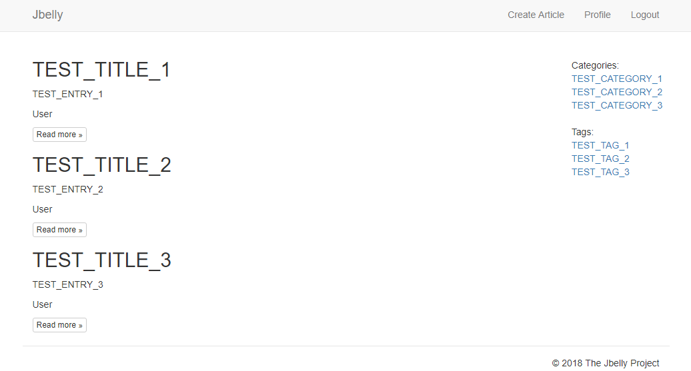

# Jbelly

Lightweight Java Blog Engine based on Spring Boot.

Built with:
* Spring Boot 2.7 (web, security, jpa, devtools)
* Thymeleaf (engine + springsecurity5)
* Java 11
* MySQL/MariaDB
* Maven
* JQuery
* Bootstrap 3
* Summernote

 

Before launch need to start MySQL/MariaDB server and create **jbelly** database with UTF-8 encoding (utf8mb4_unicode_ci).

$ mysql -u root -p

$ mysql> CREATE DATABASE jbelly CHARACTER SET utf8mb4 COLLATE utf8mb4_unicode_ci;

$ mysql> GRANT ALL PRIVILEGES ON jbelly.* TO jbelly@'%' IDENTIFIED BY 'jbelly';

$ mysql> FLUSH PRIVILEGES;

$ mysql> QUIT;

Please, see [application.properties](src/main/resources/application.properties) for additional settings.

 

Can be build/run in any IDE that supporting Maven projects or manually:

* With **predefined** environment variables (**JBELLY_MYSQL_HOST=localhost** and **JBELLY_MYSQL_PORT=3306**):

**Full:**

$ mvn clean package

$ java -jar -Xmx64m -Xss256k ./target/jbelly-0.0.1-SNAPSHOT.jar

**Short:**

$ mvn spring-boot:run

* For the **custom** host and port, set the PATH variables or run with arguments:

**Full:**

mvn clean package -DJBELLY_MYSQL_HOST=localhost -DJBELLY_MYSQL_PORT=3306

java -jar -Xmx64m -Xss256k ./target/jbelly-0.0.1-SNAPSHOT.jar --JBELLY_MYSQL_HOST=localhost --JBELLY_MYSQL_PORT=3306

**Short:**

mvn spring-boot:run -D"spring-boot.run.arguments"="--JBELLY_MYSQL_HOST=localhost --JBELLY_MYSQL_PORT=3306"

 

Blog url - http://localhost:8080/

Admin admin@example.com password: 1

User user@example.com password: 1

 

Please, see <a href="SAMPLE-IMAGES.md">SAMPLE-IMAGES.md</a> for more screenshots.

 
