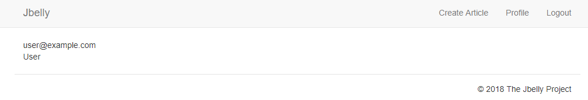
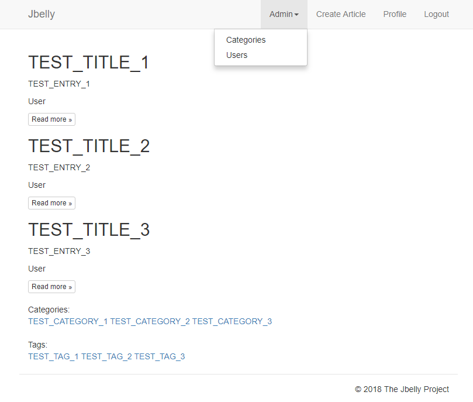
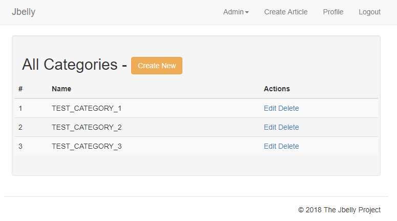
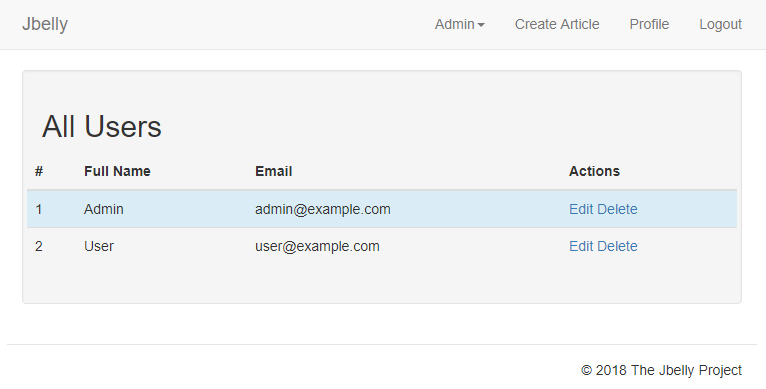

# Jbelly

Lightweight Java Blog Engine based on Spring Boot.

Built with:
* Spring Boot 1.5 (security, security-core, data-jpa, devtools)
* Thymeleaf (engine + springsecurity4)
* Java SE 1.8
* MySQL/MariaDB
* Maven
* JQuery
* Bootstrap 3
* Summernote

Can be build in any IDE that supporting Maven projects. 

Before launch need to create **jbelly** database (mysql or mariadb) with UTF-8 encoding (utf8mb4_unicode_ci). See [application.properties](https://github.com/evgeniyosipov/jbelly/blob/master/src/main/resources/application.properties).

Blog url - http://localhost:8080/

Admin admin@example.com password: 1

User user@example.com password: 1

Big thanks to SoftUni and Svetlin Nakov for great information.

